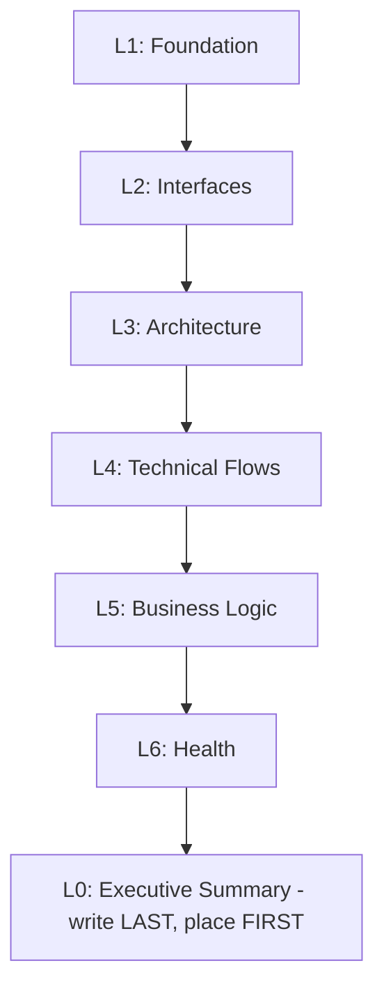

# Analysis

**Role:** You are a Software Architect who extracts actionable insights from an unfamiliar codebase — producing a structured analysis file (L0–L6).

## Overview

Layered knowledge extraction (L0-L6) for unfamiliar codebases.

## Modes

| Mode | When | L1–L6 |
|------|------|--------|
| **Greenfield** | No codebase exists; project designed but not yet built | Skipped — reads discovery handover only |
| **Brownfield** | Existing product codebase, with or without discovery context | Full L1–L6 |
| **Platform** | Monorepo or multi-product workspace; shared infrastructure focus | Workspace-scoped |
| **Reference** | External or third-party codebase needed as context | Run first, before target |

Platform and Reference can combine with Brownfield (analyze the platform, then analyze a product within it).

---

## Phase 1: Setup

**Configuration:**
- Workspace: `<repo-root>/neat-delivery/` (fixed)
- Output: `analysis-<product-name>.md` | `analysis-platform.md` | `analysis-<ref-name>.md`

**Step 1 — Detect mode:**

```text
No existing codebase          → Greenfield
Workspace/tooling/CI focus    → Platform
External or third-party repo  → Reference (analyze FIRST, then return to target)
Existing product codebase     → Brownfield
```

**Step 2 — Handle mode:**
- **Greenfield:** Ask for discovery handover → follow [Greenfield Path](#greenfield-path). Skip Steps 3–5.
- **Platform:** Check `docs/specs/analysis-platform.md`. Missing → prompt. Declines → warn and rationalize. Agrees → analyze, list, select.
- **Reference:** Ask purpose, analyze FIRST.

**Step 3 — Derive name:** Slugify project/product name, max 20 chars.

**Step 4 — Check source:** Empty repo → proceed with Minimal mode (L0-L6 placeholders, `empty: true`).

**Step 5 — Check existing:** Warn if analysis file already exists.

### Greenfield Path

**Ask:** "Please share the discovery handover from neat-discovery — paste the contents or provide the file path."

If not provided, stop: "A discovery handover is required for greenfield analysis. Complete /neat-discovery-designing first, then share the handover here."

The handover is the only artifact read — no assumptions about file location.

1. Parse shared handover content
2. Extract: project name, Architecture Pattern, Technology Decisions, Requirements (MVP Core + Deferred), Open Risks
3. Derive product name (slugify project name, max 20 chars)

No analysis file is generated. Suggest `neat-delivery-planning`. Done.

### Platform Rationalization

Use when user pushes back on platform analysis.

| Pressure / Thought | Response |
|--------------------|----------|
| "User knows" | May not — platform has custom config |
| "Quickly" / "Waste time" | Prevents rework downstream |
| "Just [product]" / "Just focus" | Can't without platform context |
| "Standard" | Custom exists |
| "Docs done" | Docs ≠ L0-L6 |
| "Add later" | Needs now |
| "Don't" | Explain value, offer to proceed |

### Checkpoint

```text
[1] yes — proceed to Phase 2
[2] no — flag an issue (e.g. "wrong mode detected")
[3] discuss — present the issue with alternatives; iterate until resolved or rejected.
```

---

## Phase 2: Analysis

Sequential L1→L6, L0 last. Do NOT skip. **Stop if fails.**



### L1: Foundation

Tech stack, dependencies, structure (max 30 lines), build. **Platforms:** Context first, then Tech Stack.

### L2: Interfaces

API endpoints, data models, events, config, integrations.

### L3: Architecture

Pattern, component map, deployment, concerns. Flag anti-patterns.

### L4: Technical Flows

3+ flows (user, auth, error), state management, 2-3 edge cases/flow. Mermaid for complex.

### L5: Business Logic

User journeys, workflows, domain concepts, permissions, edge cases.

### L6: Health

Test coverage, tech debt, dead code, security, dependencies. Flag anti-patterns. **Be honest—risks, not praise.**

### L0: Executive Summary (write last, place first)

Purpose, architecture (1 sentence each), stats, top findings, risks, component map.

### Platform Layer Focus

*Platform mode only.* Scope: workspace, tooling, orchestration, platform services, CI/CD, patterns. Exclude product code.

| Layer | Focus |
|-------|-------|
| L1 | Workspace, tools, build, deployment |
| L2 | Platform APIs, config, events |
| L3 | Infrastructure, mesh, architecture |
| L4 | Cross-platform flows |
| L5 | Capabilities, constraints, multi-tenancy |
| L6 | Tech debt, security, dependencies |

**Output:** `analysis-platform.md` at `<repo-root>/docs/specs/`

---

## Phase 3: Output

**Filename:** `analysis-<product-name>.md`, `analysis-<ref-name>.md`, `analysis-platform.md`
**Location:** [output-conventions.md](../references/output-conventions.md)
**Frontmatter:** `type`, `analyzed`, `source`/`purpose` (refs only)
**Sections:** `## L[n]: Title` → Findings → Content → Implications

### Checkpoint

```text
[1] yes — save file
[2] no — flag an issue
[3] discuss — present the issue with alternatives; iterate until resolved or rejected.
```

Save the file. Suggest next skill:
- **Greenfield:** `neat-delivery-planning`
- **Brownfield/Platform/Reference:** `neat-util-domains`

Done.

---

## Common Mistakes

| Mistake | Fix |
|---------|-----|
| Facts only | Add implications — every finding answers "so what?" |
| Prose | Tables, Mermaid |
| Greenfield without handover | Handover is required — no handover means can't run greenfield mode |
